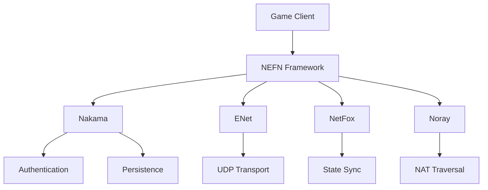

# NEFN Framework
## A Modular Godot Multiplayer Framework

NEFN is a comprehensive multiplayer networking framework for Godot 4.x that integrates Nakama, ENet, NetFox, and Noray to provide a robust, scalable solution for multiplayer game development.

## Features

- **Modular Architecture**: Combines the best features of Nakama, ENet, NetFox, and Noray
- **Server Management**: Complete server management system with multiple modes
- **Anti-Cheat System**: Built-in protection against common cheating methods
- **Performance Monitoring**: Real-time server metrics and performance tracking
- **Rollback Netcode**: State management and reconciliation for smooth gameplay
- **Administration Tools**: Command system for server management
- **Backup System**: Automatic state backups with rotation
- **Scalability**: Support for large player counts and dynamic resource management

## Requirements

- Godot 4.x
- Nakama Server (for authentication and persistence)
- Noray Server (for NAT traversal and relay)

## Installation

1. Clone the repository:
```bash
git clone https://github.com/yourusername/nefn-framework.git
```

2. Copy the `addons/nefn` directory to your Godot project's `addons` folder.

3. Enable the plugin in Godot:
   - Project -> Project Settings -> Plugins
   - Find "NEFN Framework" and click "Enable"

## Quick Start

### Server Setup

```gdscript
# Create server configuration
var config = NEFNServerConfig.new()
config.server_ip = "0.0.0.0"
config.port = 7350
config.max_clients = 32

# Initialize and start server
var server = NEFNServerManager.new(config)
server.start_server()
```

### Client Setup

```gdscript
# Connect to server
var client = NEFNClientManager.new()
client.connect_to_server("127.0.0.1", 7350)

# Handle connection events
client.connected.connect(_on_connected)
client.disconnected.connect(_on_disconnected)
```

## Documentation

- [Framework Documentation](docs/NEFN_Framework.md)
- [Server Configuration Guide](docs/ServerConfig.md)
- [API Reference](docs/API_Reference.md)

## Architecture

NEFN uses a modular architecture that combines:

- **Nakama**: Authentication, matchmaking, and persistence
- **ENet**: Low-level networking and UDP transport
- **NetFox**: High-performance networking layer
- **Noray**: NAT traversal and relay services

### Component Integration



## Examples

The `examples` directory contains sample implementations:

- Basic server setup
- Client implementation
- Multiplayer game example
- Chat system
- Voice chat integration

## Contributing

1. Fork the repository
2. Create your feature branch (`git checkout -b feature/amazing-feature`)
3. Commit your changes (`git commit -m 'Add amazing feature'`)
4. Push to the branch (`git push origin feature/amazing-feature`)
5. Open a Pull Request

## License

This project is licensed under the MIT License - see the [LICENSE](LICENSE) file for details.

## Acknowledgments

- Godot Engine
- Nakama Team
- NetFox Contributors
- Noray Developers

## Support

For support, please:

1. Check the [documentation](docs/)
2. Search [existing issues](https://github.com/yourusername/nefn-framework/issues)
3. Create a new issue if needed

## Roadmap

- [ ] Enhanced anti-cheat features
- [ ] WebRTC support
- [ ] Cross-platform voice chat
- [ ] Improved state synchronization
- [ ] Additional admin tools
- [ ] Performance optimizations
- [ ] WebSocket support
- [ ] Docker deployment scripts

## Security

Please report security vulnerabilities to security@your-domain.com.

For secure deployment:

1. Always enable anti-cheat in production
2. Use secure passwords for admin access
3. Configure appropriate rate limits
4. Enable logging in production
5. Regularly update dependencies

## Performance Tips

1. Configure appropriate tick rates
2. Enable multithreading when possible
3. Use packet batching for efficiency
4. Monitor server metrics
5. Adjust thread count based on load

## FAQ

**Q: Can I use NEFN without Nakama?**
A: Yes, the framework is modular. You can use only the components you need.

**Q: What's the maximum player count?**
A: Depends on your server resources and game type. The framework has been tested with 200+ concurrent players.

**Q: Does it support WebSocket?**
A: Currently in development. ENet is the primary transport layer.

## Contact

- Website: your-website.com
- Twitter: @your-twitter
- Discord: your-discord-server

## Related Projects

- [Nakama](https://github.com/heroiclabs/nakama)
- [NetFox](https://github.com/netfox)
- [Noray](https://github.com/noray) 
 
